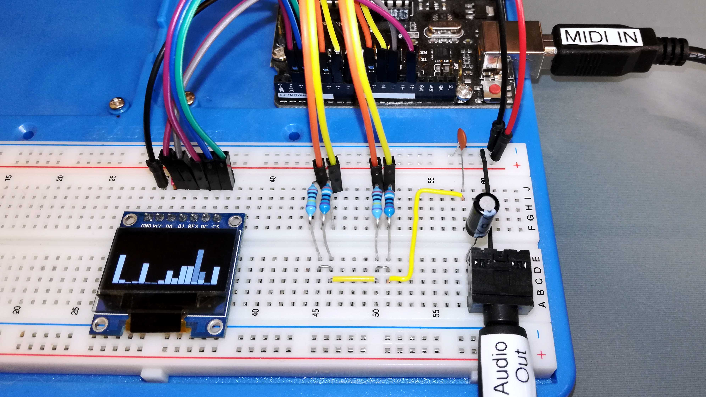
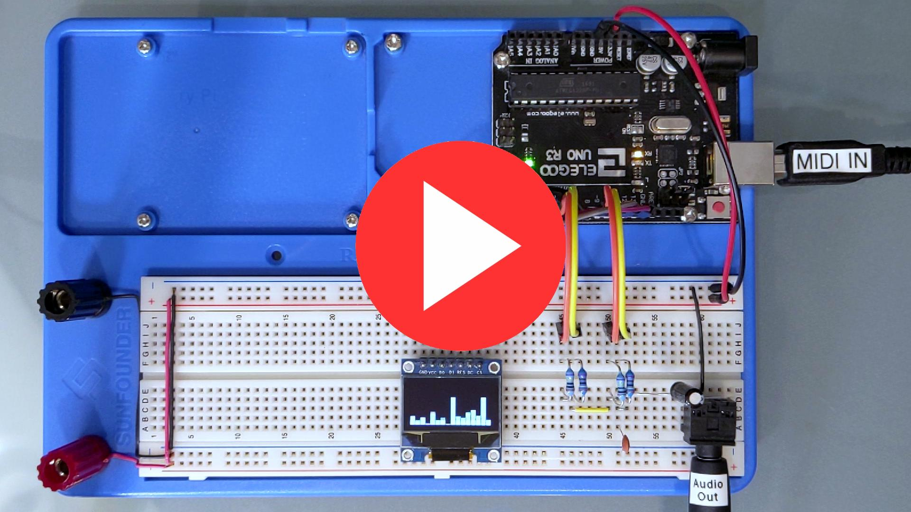
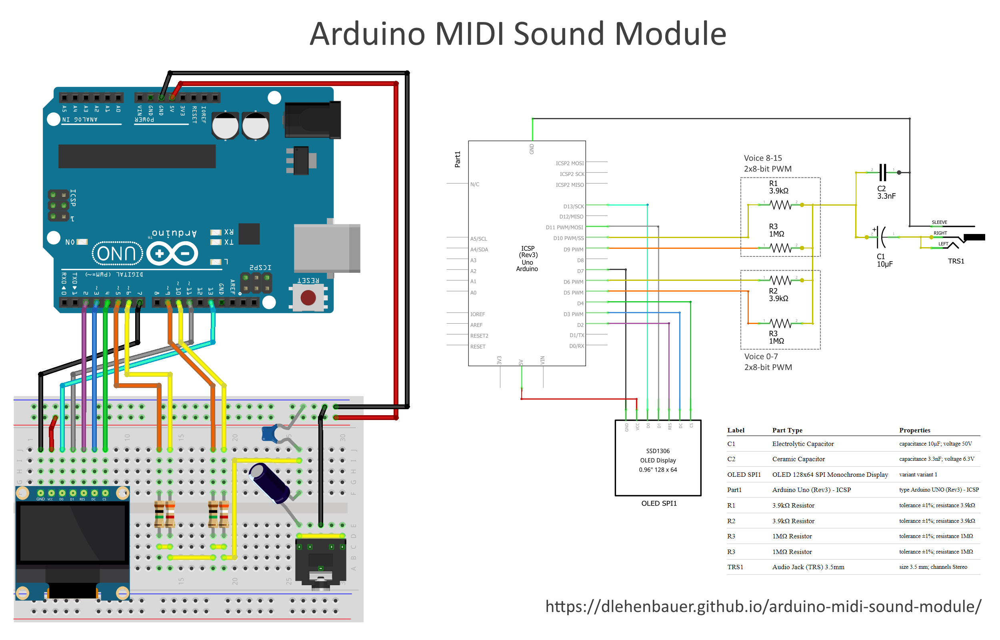

# Arduino MIDI Sound Module
Turn your Arduino Uno into a 16-voice wavetable synthesizer/MIDI sound generator.

# General MIDI Subset
Implements the most commonly used features of the General MIDI 1.0 standard, including:
* 128 standard instruments
* 45 percussion instruments
* 16 note polyphony with key velocity
* Note on/off, program change, pitch bend, channel volume and all notes off.

Hear it in action:

# Synth Engine      
* 16 voices sampled & mixed in real-time at ~20kHz
* Wavetable and white noise sources
* Amplitude, frequency, and wavetable offset modulated by envelope generators
* Additional volume control per voice (used for MIDI volume and velocity)
* Documented C++ code builds in Arduino IDE or Atmel Studio 6.0

# Hardware

# Resources
* [Open Music Labs - PWM DAC](http://www.openmusiclabs.com/learning/digital/pwm-dac.1.html)
* [Open Music Labs - Dual PWM Circuits](http://www.openmusiclabs.com/learning/digital/pwm-dac/dual-pwm-circuits/index.html)
